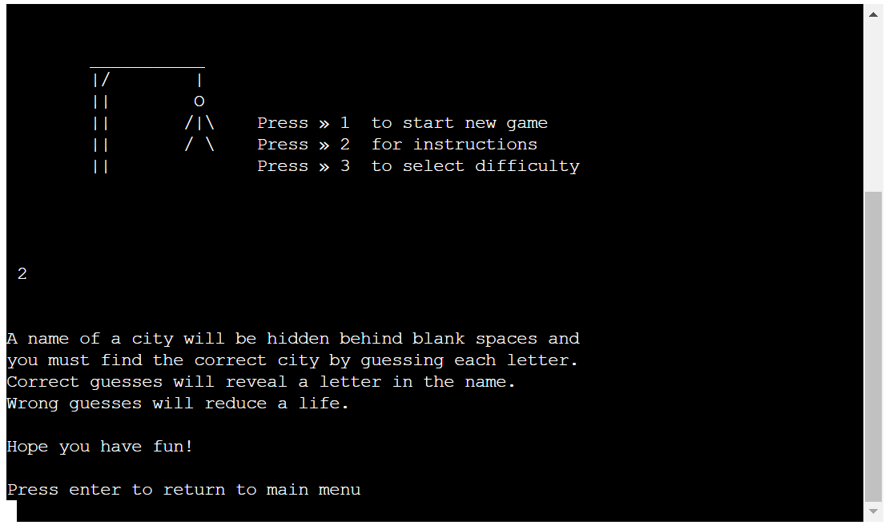
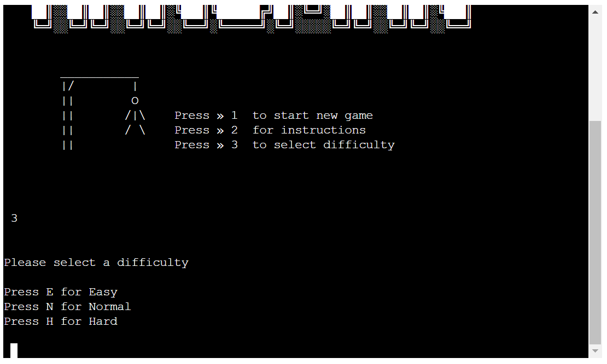

# Hangman

View the live site [here](https://project-hangman3.herokuapp.com/)

---

## CONTENTS

* [User Experience](#user-experience-ux)
  * [User Stories](#user-stories)

* [Design](#design)
  * [Colour Scheme](#colour-scheme)
  * [Typography](#typography)
  * [Imagery](#imagery)
  * [Wireframes](#wireframes)

* [Features](#features)
  * [General Features on Each Page](#general-features-on-each-page)
  * [Future Implementations](#future-implementations)
  * [Accessibility](#accessibility)

* [Technologies Used](#technologies-used)
  * [Languages Used](#languages-used)
  * [Frameworks, Libraries & Programs Used](#frameworks-libraries--programs-used)

* [Deployment & Local Development](#deployment--local-development)
  * [Deployment](#deployment)
  * [Local Development](#local-development)
    * [How to Fork](#how-to-fork)
    * [How to Clone](#how-to-clone)

* [Testing](#testing)

* [Credits](#credits)
  * [Code Used](#code-used)
  * [Content](#content)
  * [Media](#media)
  * [Acknowledgments](#acknowledgments)

---

## User Experience (UX)

### User Stories

#### Client goals visitors

#### First-time visitors 

#### Returning visitors 

## Design

### Finished site

### Imagery

I wanted to have a background image with Naruto (The main character of the Manga and Anime series 'Naruto'). I had to cut out the emblem displayed inside the original image using Paint, to have a full black background to have the elements on top of. 

#### Original Background Image

### Wireframes

The wireframes were created using Balsamiq. I wanted to have a simple layout with the game buttons centred in the middle of the page, and the scores and reset button close to the centre for easy view. The "How to Play" button is a little bit more discrete and I chose to have it in the upper left corner. 

## Features

#### Start-up

#### Instructions

#### Game Difficulty

### Future Implementations

I would like to add a function to allow the user to guess a full word (or city in this program). Right now it is currently only possible to guess one letter at the time. 

### Accessibility

I have tried my best to be mindful of accessibility, and the steps I've taken for this are the following:

- Easier readability by using a good amount of spaces in the prints. 
- Symbols and "imagery" that has good contrast. 

## Technologies Used

Please see # Media

### Languages Used

The language I've used is Python3.

### Frameworks, Libraries & Programs Used

## Deployment & Local Development

### Deployment

#### Heroku

The project was deployed to GitHub Pages using the following steps...

1. Login to Heroku and go to your Apps. Select the app/project you wish to deploy.
2. Click on the "Deploy" section to view alternatives.
3. Inside the "Deploy" section, go to "Deployment method".
4. Connect your GitHub account to your Heroku project. 
5. Choose the project you wish to deploy in the "App connected to GitHub" section below.
6. Enable Automatic deploys.

### Local Development

#### How to Fork

To fork my repository:

1. Login (or sign up) to GitHub.
2. Go to the repository for this project [here](https://github.com/nicolemne/project-portfolio-3)
3. Click the Fork button in the top right corner.

#### How to Clone

If you wish to clone my project, please see the following steps below:

Navigate to Github: https://github.com/nicolemne/project-portfolio-3
Select the 'Clone' button
Copy the URL or download it as a ZIP file
Use git clone + the URL in your terminal, or unpack the ZIP containing the project

## Testing

### PEP8 Validator

### Known bugs

No known bugs.

### Solved Bugs

I've encountered several bugs on the journey of making this website, and most of them I've corrected by seeking help online or from my mentor Mitko. 

Some bugs I've encountered and fixed: 

+ Background Image
  + Description: Background image placement
  + Expected behaviour: Cover full screen
  + Actual behaviour: Not showing up
  + Fix: background-position: center; and background-size: cover;

+ Script not running
  + Description: Javascript not working
  + Expected behaviour: Run in the browser to play game
  + Actual behaviour: Nothing happening
  + Fix: Correct variable names that were written wrong

+ Wrong game message
  + Description: "Starting New Game" randomly appearing
  + Expected behaviour: Only shown when resetting scores
  + Actual behaviour: Randomly appearing in the game message announcer
  + Fix: Set the correct name of the variable in winCombos

## Credits

### Code Used

I have used the following student's projects to help me structure my program and build my code, as well as a video.

[Gibbo101](https://github.com/gibbo101/hangman)
[TaraHelberg](https://github.com/TaraHelberg/Hang-Hangman)
[How to build HANGMAN with Python in 10 MINUTES](https://www.youtube.com/watch?v=m4nEnsavl6w)

### Content

I have written all content on this website myself, although I've used a lot of help from other projects, please see section above in # Code used.

###  Media

[CoolSymbol](https://coolsymbol.com/) was used to get special characters to style the program. 
- » in the start up menu 
- ░ for blank spaces
- ★ before the lives and guesses
- ✟ when you've run out of lives

[fsymbol](https://fsymbols.com/generators/carty/) - To generate the "Let's play..." and "Hangman" text.

[Gibbo101](https://github.com/gibbo101/hangman) - To get the hangman imagery that changes with each life left

  
###  Acknowledgments

I would like to thank and acknowledge the following people, who have shown invaluable support throughout my second project:

- Dan Ford, boyfriend and biggest supporter.
- Mitko Bachvarov, my mentor at Code Institute, for the great help and support with my project. 
- Joseph Doble, for providing easy-to-understand explanations and help with my questions.
- Emelie, a fellow student at Code Institute, whom I've also had great support from.
- Kera Cudmore, for this README template.