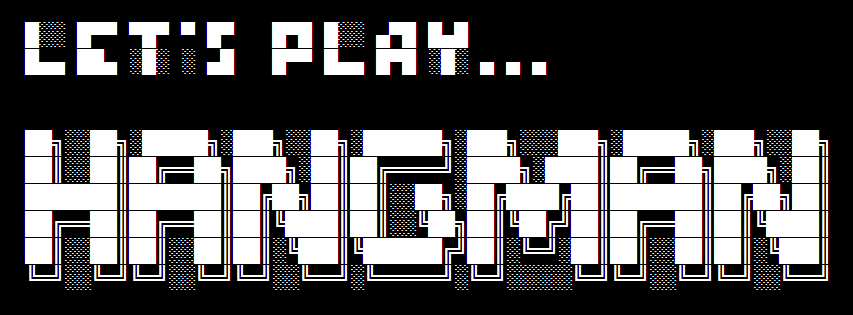
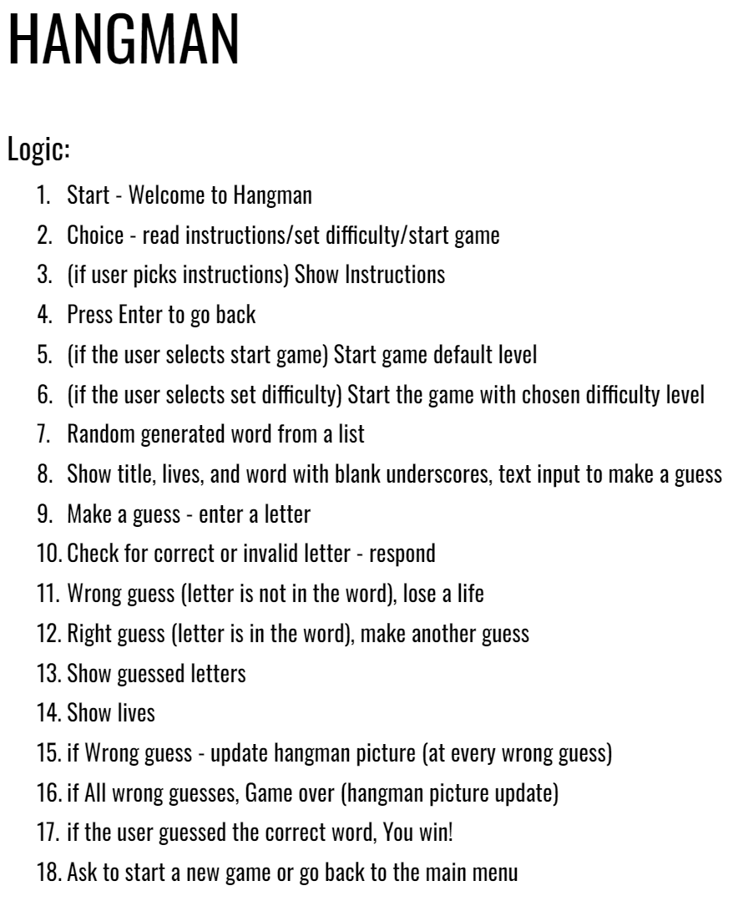
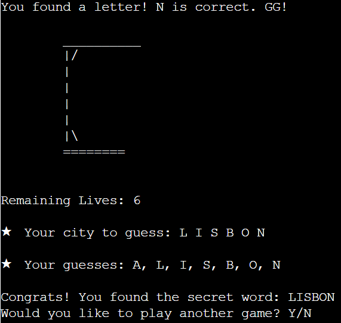
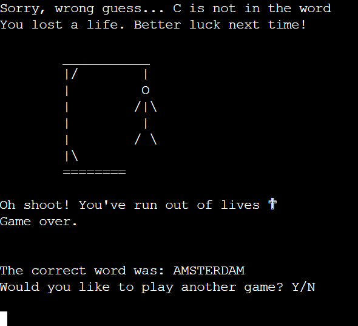
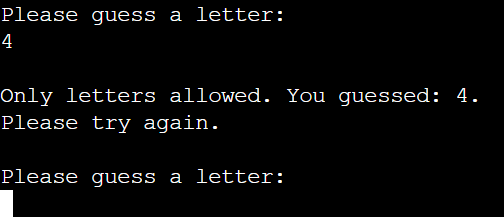
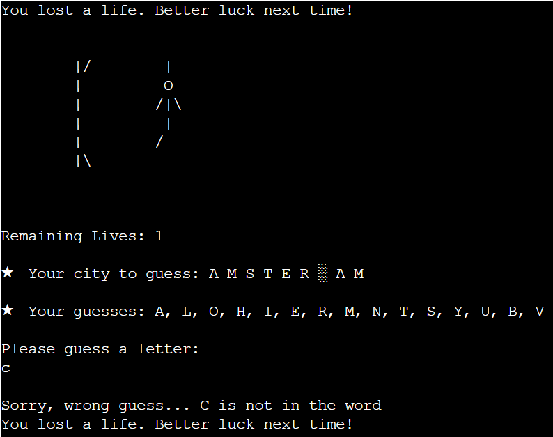
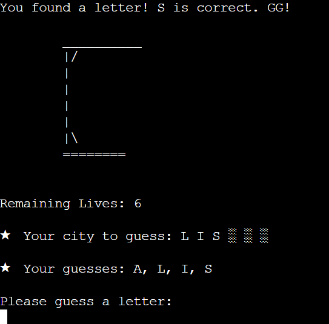
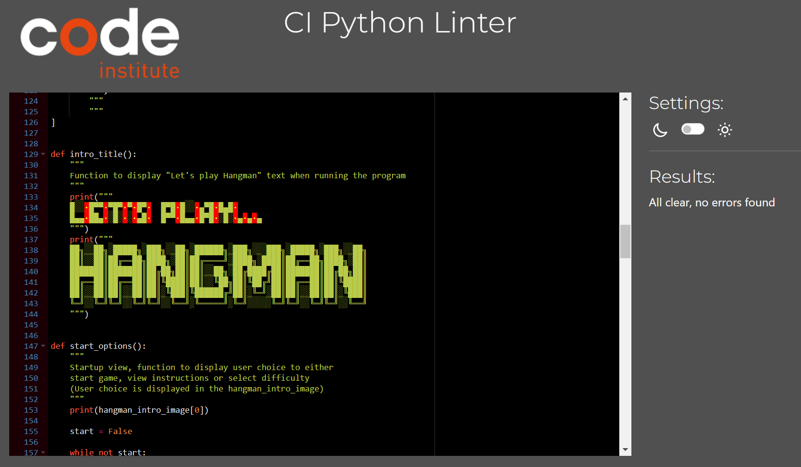

# Hangman

For my third project, written solely in Python, I decided to do a Hangman game. The main game function is to guess each letter in a hidden word, and in this project I've chosen to go with capital cities. For each correct guess a letter will be revealed.

You can play the game on three difficulties. Either Easy with 10 lives, Normal with 7 lives, and Hard with 5 lives. The default is Normal difficulty. 

The game is presented with some visual imagery when you first start up the program, and have a consistent design throughout the whole program.

View the live site [here](https://project-hangman3.herokuapp.com/).

---

## CONTENTS

* [User Experience](#user-experience-ux)
  * [User Stories](#user-stories)

* [Design](#design)
  * [Colour Scheme](#colour-scheme)
  * [Typography](#typography)
  * [Imagery](#imagery)
  * [Wireframes](#wireframes)

* [Features](#features)
  * [General Features on Each Page](#general-features-on-each-page)
  * [Future Implementations](#future-implementations)
  * [Accessibility](#accessibility)

* [Technologies Used](#technologies-used)
  * [Languages Used](#languages-used)
  * [Frameworks, Libraries & Programs Used](#frameworks-libraries--programs-used)

* [Deployment & Local Development](#deployment--local-development)
  * [Deployment](#deployment)
  * [Local Development](#local-development)
    * [How to Fork](#how-to-fork)
    * [How to Clone](#how-to-clone)

* [Testing](#testing)

* [Credits](#credits)
  * [Code Used](#code-used)
  * [Content](#content)
  * [Media](#media)
  * [Acknowledgments](#acknowledgments)

---

## User Experience (UX)

### User Stories

#### Client goals visitors

My goals for this application is to be fun, accessible and smooth running gameplay.

#### First-time visitors 

I want my first time visitors to be able to quickly navigate throughout the start menu to choose difficulty, read instructions or go straight into a new game. The design I've chosen is for the program to look aesthetically pleasing and fun, which will encourage the user to keep playing.

#### Returning visitors 

My hope is for a first time user to have a great experience playing this game, so that they will return to play again. 

## Design

### Finished site

### Imagery

 
 

### Planning

In order to plan this project I wrote notes of every logical step in a Google document, to help me figure out key points of the applicaton.

 

## Features

#### Start-up

#### Instructions

#### Set Difficulty

#### Win

#### Lose

#### Check numbers

#### More than one character

#### Previous guesses

#### Found correct letter

### Future Implementations

I would like to add a function to allow the user to guess a full word (or city in this program). Right now it is currently only possible to guess one letter at the time. 

### Accessibility

I have tried my best to be mindful of accessibility, and the steps I've taken for this are the following:

- Easier readability by using a good amount of spaces in the prints. 
- Symbols and "imagery" that has good contrast. 

## Technologies Used

Please see # Media

### Languages Used

The language I've used is Python.

## Deployment & Local Development

### Deployment

#### Heroku

The project was deployed to GitHub Pages using the following steps...

1. Login to Heroku and go to your Apps. Select the app/project you wish to deploy.
2. Click on the "Deploy" section to view alternatives.
3. Inside the "Deploy" section, go to "Deployment method".
4. Connect your GitHub account to your Heroku project. 
5. Choose the project you wish to deploy in the "App connected to GitHub" section below.
6. Enable Automatic deploys.

### Local Development

#### How to Fork

To fork my repository:

1. Login (or sign up) to GitHub.
2. Go to the repository for this project [here](https://github.com/nicolemne/project-portfolio-3)
3. Click the Fork button in the top right corner.

#### How to Clone

If you wish to clone my project, please see the following steps below:

Navigate to Github: https://github.com/nicolemne/project-portfolio-3
Select the 'Clone' button
Copy the URL or download it as a ZIP file
Use git clone + the URL in your terminal, or unpack the ZIP containing the project

## Testing

### PEP8 Validator

No errors found. 

### Known bugs

No known bugs.

### Solved Bugs

Some bugs I've encountered and fixed: 

+ Select difficulty
  + Description: The menu for selecting difficulty appeared twice
  + Expected behaviour: Choosing a difficulty and go straight into the game
  + Actual behaviour: The menu for selecting difficulty appeared again after you had chosen a difficulty, and did not go straight into the play_game function
  + Fix: Remove second function call inside the game_difficulty function

+ Only one blank (hidden) letter
  + Description: Only one blank letter appeared
  + Expected behaviour: Display a blank space or underscore for each letter in the word
  + Actual behaviour: Only showing the first letter, the rest removed
  + Fix: Check for correct word instead of guessed letters.

+ Launching default
  + Description: Launching default difficulty instead of chosen difficulty from the game_difficulty function
  + Expected behaviour: Start game with selected difficulty level
  + Actual behaviour: Always launching game in default level
  + Fix: Removed call function play_game from inside start_options

## Credits

### Code Used

I have used the following student's projects to help me structure my program and build my code, as well as a video.

- [Gibbo101](https://github.com/gibbo101/hangman)
- [TaraHelberg](https://github.com/TaraHelberg/Hang-Hangman)
- [How to build HANGMAN with Python in 10 MINUTES](https://www.youtube.com/watch?v=m4nEnsavl6w)

### Content

I have written all content on this website myself, although I've used a lot of help from other projects, please see section above in # Code used.

###  Media

[CoolSymbol](https://coolsymbol.com/) was used to get special characters to style the program. 
- » in the start up menu 
- ░ for blank spaces
- ★ before the lives and guesses
- ✟ when you've run out of lives

[fsymbol](https://fsymbols.com/generators/carty/) - To generate the "Let's play..." and "Hangman" text.

[Gibbo101](https://github.com/gibbo101/hangman) - To get the hangman imagery that changes with each life left

  
###  Acknowledgments

I would like to thank and acknowledge the following people, who have shown invaluable support throughout my second project:

- Dan Ford, boyfriend and biggest supporter.
- Mitko Bachvarov, my mentor at Code Institute, for the great help and support with my project. 
- Joseph Doble, for providing easy-to-understand explanations and help with my questions.
- Kera Cudmore, for this README template.